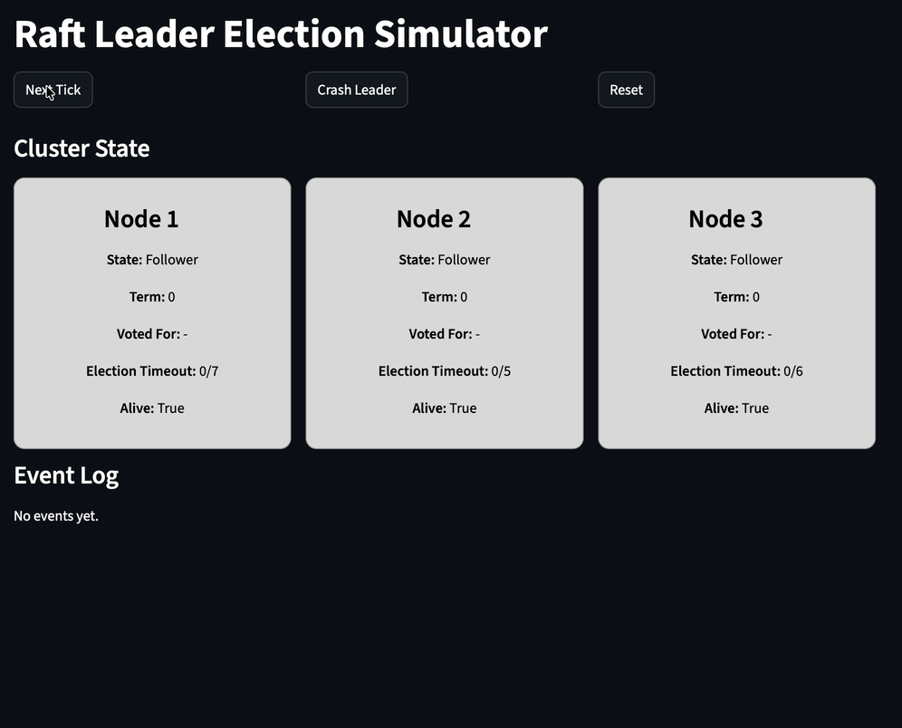

# Raft Leader Election Simulator

A simple and interactive simulator to visualize **leader election in the Raft consensus algorithm**.

This project demonstrates how distributed systems select a leader and recover from failures.

---

## 🚀 Demo



---

## 📌 Overview

In distributed systems, multiple nodes must agree on a shared state.  
Raft simplifies this process by electing a **single leader** that coordinates all operations.

This simulator focuses on:

- Leader election
- Majority voting
- Failure recovery (leader crash)
- Heartbeat mechanism

---

## ⚙️ How It Works

### 1. Follower State
All nodes start as **followers** and wait for a leader.

### 2. Election Timeout
If a follower does not receive a heartbeat, it becomes a **candidate**.

### 3. Candidate State
- Increments term
- Votes for itself
- Requests votes from other nodes

### 4. Leader Election
If a candidate receives a **majority of votes**, it becomes the **leader**.

### 5. Heartbeat
The leader periodically sends heartbeats to maintain authority.

### 6. Failure Recovery
If the leader crashes:
- Followers stop receiving heartbeats
- A new election is triggered
- A new leader is elected

---

## 🧩 Project Structure
```
 .
 ┣ 📜app.py # Streamlit UI
 ┣ 📜cluster.py # Cluster logic (election, heartbeat)
 ┣ 📜constants.py # Configuration values
 ┣ 📜node.py # Individual node behavior
```
---

## 🛠️ How to Run

1. Install dependencies:
```bash
pip install streamlit
```
2. Run the simulator:
```bash
streamlit run app.py
```
## 🎮 Controls

- **Next Tick** → Advances time in the simulation  
- **Crash Leader** → Simulates leader failure  
- **Reset** → Restarts the cluster  

---

## 💡 Key Insights

- Only one leader exists at a time  
- A majority vote is required to elect a leader  
- Randomized timeouts prevent split votes  
- The system continues operating even after failures  

---

## 🔗 Related Blog Post

This project is part of a series on distributed systems:

👉 Raft Leader Election: How a Distributed System Chooses a Leader  

---

## 📖 References

- Diego Ongaro, John Ousterhout. *In Search of an Understandable Consensus Algorithm (Raft)*  
